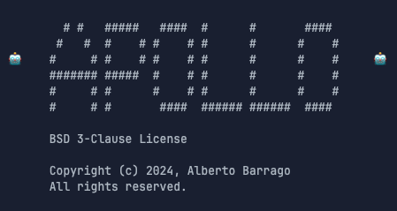

# ApolloAgent



ApolloAgent is a custom AI agent that implements various functions for code assistance.

> "_ApolloAgent is a versatile PoC showcasing how AI-driven tools can simplify coding tasks and enhance productivity._"

ApolloAgent provides the following functionality:

- **Codebase Search**: Find snippets of code relevant to a search query.
- **Directory Listing**: Get insights into your folder and project structure.
- **Grep Search**: Perform fast, text-based regex searches within files or directories.
- **File Search**: Locate files quickly using fuzzy matching on file paths.
- **File Operations**: Delete and edit files directly through the agent.
- **Reapply Edits**: Reapply the last edit to a chosen file with ease.
- **Chat Interface**: Engage conversationally with ApolloAgent, powered by Google's Gemini Flash AI.
- **Continuous Mode**: Chat and execute Python code seamlessly during interactive sessions.

## Installation

Ensure you have Python 3.8+ installed.

```bash
# Clone the repository
git clone https://github.com/albertobarrago/ApolloAgent.git

# Navigate to the project directory
cd ApolloAgent

# Install dependencies
pip install -r requirements.txt
```

If no `requirements.txt` is included, install dependencies manually as needed.

## Usage

To start ApolloAgent, simply run:

```bash
python main.py
```

You can:
- Search for a file: `search filename.py`
- Use the chat interface for assistance: `chat [query]`

## License

ApolloAgent is licensed under the BSD 3-Clause License. See the `LICENSE` file for more details.

## Contributing

We welcome contributions to ApolloAgent! If you'd like to help:
- Report bugs or suggest new features via [GitHub Issues](https://github.com/AlbertoBarrago/Apollo-Agent/issues).
- Submit pull requests for enhancements or changes.
