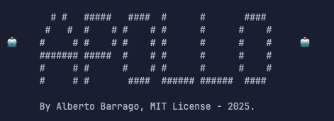

# ApolloAgent



ApolloAgent is a custom AI agent that implements various functions for code assistance.

## Features

ApolloAgent provides the following functionality:

- **Codebase Search**: Find snippets of code from the codebase most relevant to a search query
- **Directory Listing**: List the contents of a directory
- **Grep Search**: Fast text-based regex search that finds exact pattern matches within files or directories
- **File Search**: Fast file search based on fuzzy matching against a file path
- **File Operations**: Delete and edit files
- **Reapply Edits**: Reapply the last edit to a specified file
- **Chat Interface**: Interact with Apollo conversationally, powered by Google's Gemini Flash AI
- **Continuous Mode**: Chat and execute Python code in a seamless, continuous session

## Installation

```bash
# Clone the repository
git clone https://github.com/albertobarrago/ApolloAgent.git

# Navigate to the project directory
cd ApolloAgent

# Install dependencies (if any)
pip install -r requirements.txt  # Create this file if you have dependencies
```

## Use 
```bash
python main.py
```